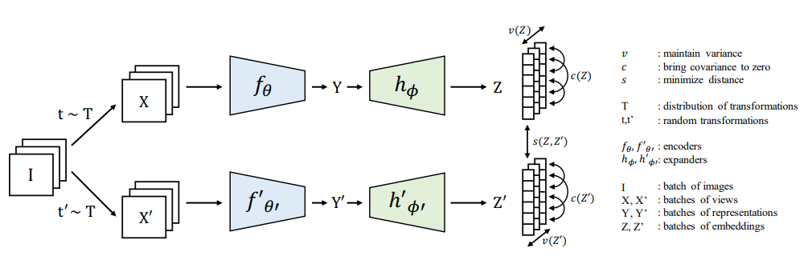

# CS682_FinalProject

## VICREG notes from https://arxiv.org/pdf/2105.04906.pdf

A Self Supervised Method for Training Joint Embedding Architectures.

Loss Function Uses 3 terms:

1. Invariance: Mean Squared Distance Between Embedding Vectors

2. Variance : A hinge loss to maintain the standard deviation (over a batch) of each variable of the embedding above a given threshold. This term forces the embedding vectors of samples
within a batch to be different.

3. Covariance: a term that attracts the covariances (over a batch) between every pair of
(centered) embedding variables towards zero. This term decorrelates the variables of each
embedding and prevents an informational collapse in which the variables would vary
together or be highly correlated.

### Method:

Given Image i sampled from Dataset D. 2 Transformations t and $t`$ are sampled from Distribution T which produced 2 different views x = t(i) and $x`$ = $t`$(i).

Distribution T is created as follows:

1. Random Cropping with size ratio between .08 and 1.0 with resizing. RandomResizedCrop(32, scale=(0.08, 0.1)) in PyTorch.
2. Random horizontal flip with probability 0.5.
3. Color jittering of brightness, contrast, saturation and hue, with probability 0.8.
ColorJitter(0.4, 0.4, 0.2, 0.1) in PyTorch.
4. Grayscale with probability 0.2
5. Gaussian blur with probability 0.5 and kernel size 23. (Do we keep the sample kernel size for cifar-10?)
6. Solarization with probability 0.1.
7. Color normalization with mean (0.485, 0.456, 0.406) and standard deviation (0.229, 0.224,
0.225).

Views x and $x`$ are fire encoded by f into representations y = f(x) and $y`$= f($x`$). They are then mapped by the expander h onto embeddings z = h(y) and $z`$ = h($y`$). Loss is computed at embedding level z and $z`$

Images are processed in batches.

For a given batch, we denote Z = [z_1, ...z_n] and $Z`$ [$z`_1$,.....,z`_n]

variance regulaization term = $$v(Z) = \frac{1}{d} \sum\limits_{j=1}^d max(0, y - S(z^j, \epsilon)) $$ 

S is regularized standard deviation defined by $$S(x, \epsilon) = \sqrt{Var(x) + \epsilon}$$

y is a constant that is 1, and $\epsilon$ is a smalar scalar to prevent instability.

Covaraince of Matrix Z is defined as $$C(Z)  = \frac{1}{n-1} \sum\limits_{i=1}^n(z_i - \bar{z})(z_i-\bar{z})^T $$

$$ \bar{z} = \frac{1}{n} \sum\limits_{i=1}^n z_i$$

Covaraince regularization term c: 

$$c(Z) = \frac{1}{d}\sum\limits_{i != j}[C(Z)]^2_{i,j}$$

invaraince criterion s:

$$ s $$
#### Semi-Supervised Evaluation:

Linear Classifier with 10% of labels with SGD Optimizer. No weight decay, batch size of 256 and train epochs of 20. Hyperparameter Tune with grid-search. 
